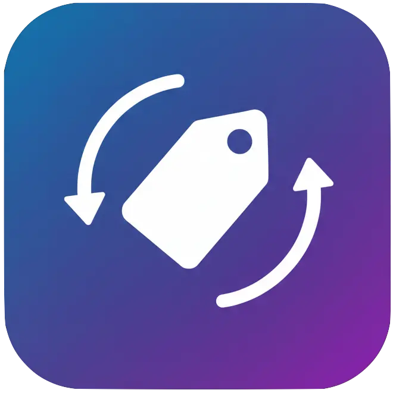
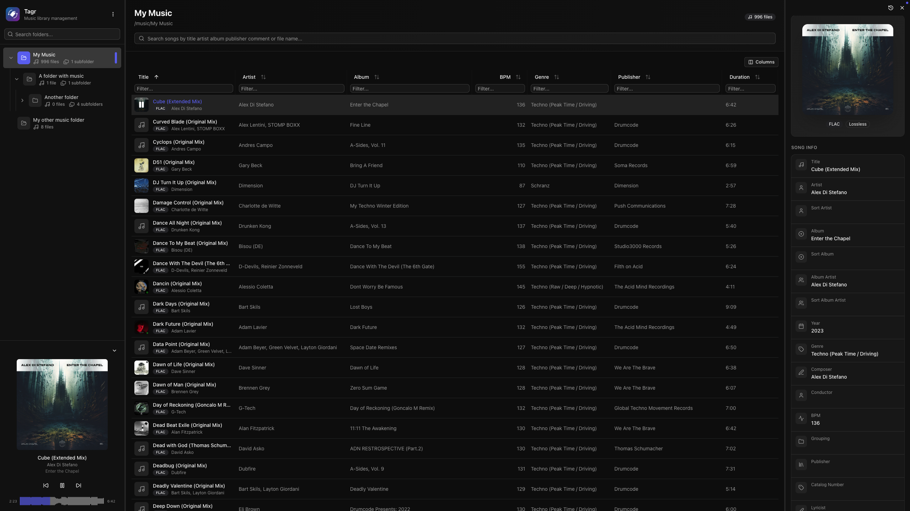
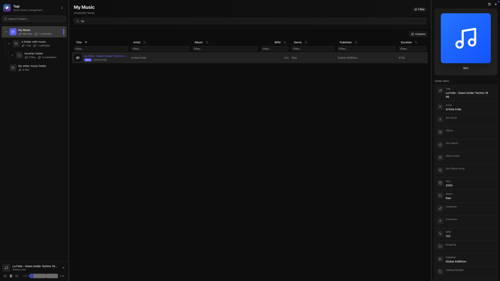
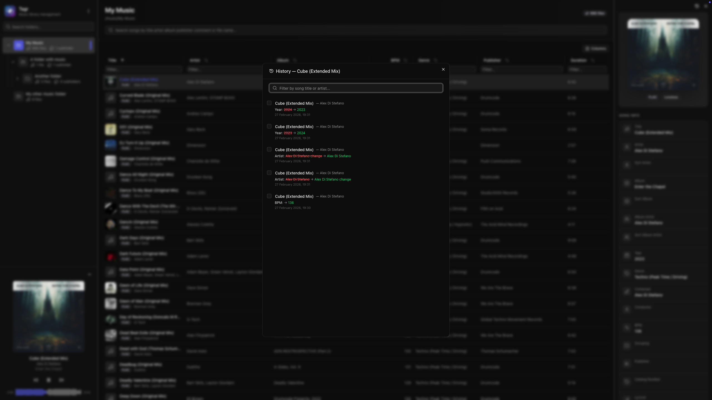
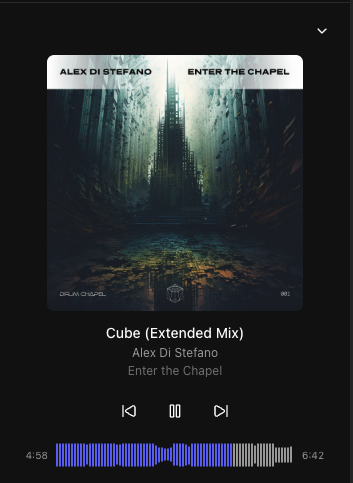
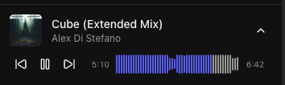
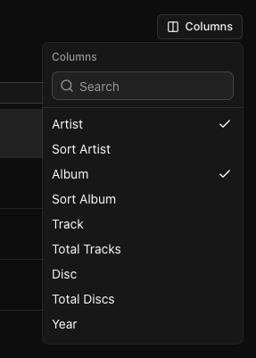

<p align="center">
  
</p>

<h1 align="center">Tagr</h1>

<p align="center"><strong>A self-hosted music metadata editor with a modern, intuitive web UI.</strong></p>

Tagr lets you browse, edit, and manage audio file tags from any browser. Just point it at your music folders, and get a clean three-panel interface for organizing your library — no desktop apps, no CLI wizardry.



---

## Why?

Most metadata editors are either desktop-only, command-line tools, or bloated apps with steep learning curves. If your music lives on a NAS, a server, or a headless machine, editing tags means SSH, mounting drives, or syncing files back and forth.

Tagr takes a different approach:

- **Run it anywhere** — Docker, bare metal, your NAS. If it runs Node.js, it runs Tagr.
- **Edit from any browser** — No installs, no plugins. Just open a tab.
- **Do one thing well** — Browse your library, edit tags, save. That's it.

---

## Features

### Metadata Editing

- Edit **40+ metadata fields** inline — title, artist, album, year, genre, composer, BPM, lyrics, and more
- **Album art** management — view, replace, and upload cover images directly
- **Star ratings** (1–5) with a visual widget
- Support for track/disc numbering, sort fields, catalog numbers, barcodes, and extended tags
- Read-only display of audio properties (codec, bitrate, sample rate, channels, bits per sample)



### Change History

- **Full audit trail** of every metadata change with old and new values
- **Revert** individual changes or bulk-select and undo multiple edits at once
- Searchable history with shift+click and ctrl+click multi-selection
- Per-song and per-folder history views



### Music Player

- **Built-in audio player** with interactive waveform visualization (WaveSurfer.js)
- Play/pause, previous/next track navigation
- Click-to-seek on the waveform
- Auto-advance to next song
- Collapsible sidebar player with album art, title, and artist display

<p>
  
  &nbsp;&nbsp;
  
</p>

### Library Browsing

- **Three-panel layout** — folder tree, song list, and detail editor side by side
- **Folder tree** with hierarchical navigation and real-time search
- **Sorting** on any column — title, artist, album, year, duration, bitrate, date added, and dozens more
- **Advanced filtering** — text, numeric ranges, date ranges, and boolean filters across all fields
- **Customizable columns** — show/hide any of 40+ columns to match your workflow
- Virtual scrolling and infinite pagination for large libraries

<p>
  
  &nbsp;&nbsp;
  
</p>

### File Support

| Format | Supported |
|--------|-----------|
| MP3    | Yes       |
| FLAC   | Yes       |
| WAV    | Yes       |
| AAC    | Yes       |
| OGG    | Yes       |
| M4A    | Yes       |
| WMA    | Yes       |
| AIFF   | Yes       |

Lossless formats are automatically detected and displayed with a badge.

### Additional

- **Single-user authentication** — password-protected access
- **Resizable panels** — drag to resize the three-panel layout to your liking
- **Dark theme** by default
- **Toast notifications** for operation feedback
- **URL-based state** — bookmarkable views with folder, song, sort, and filter state preserved in the URL


---

## Quick Start with Docker

### 1. Clone the repository

```bash
wget https://raw.githubusercontent.com/suitux/Tagr/main/docker-compose.yml
```

### 2. Generate a secret key

```bash
openssl rand -hex 32
```

Copy the output — you'll use it as `AUTH_SECRET` in the next step.

### 3. Configure `docker-compose.yml`

```yaml
services:
  tagr:
    build:
      context: .
      dockerfile: Dockerfile
    container_name: tagr
    restart: unless-stopped
    ports:
      - "3000:3000"
    environment:
      - PUID=1000
      - PGID=1000
      - NODE_ENV=production
      - DATABASE_URL=file:/data/tagr.db
      - AUTH_SECRET=paste-your-generated-secret-here
      - AUTH_USER=admin
      - AUTH_PASSWORD=your-password-here
    volumes:
      - sqlite_data:/data
      # Mount your music folder into the container:
      - /path/to/your/music:/music

volumes:
  sqlite_data:
```

> **Multiple folders:** If your music is spread across different host paths, mount them as subdirectories under `/music`. Tagr scans `/music` recursively, so all subdirectories are included automatically:
>
> ```yaml
> volumes:
>   - /home/user/Music:/music/library
>   - /mnt/nas/Music:/music/nas
> ```
>
> Set `MUSIC_FOLDERS` only if you want to **restrict** scanning to specific subdirectories (e.g., scan `/music/library` but skip `/music/podcasts`).

### 4. Build and run

```bash
docker compose up -d
```

### 5. Open your browser

Navigate to [http://localhost:3000](http://localhost:3000), log in with your credentials, and hit the **scan** button to index your library.

---

## Manual Installation

Requirements: **Node.js 22+**.

```bash
git clone https://github.com/suitux/Tagr.git
cd tagr
pnpm install
```

Create a `.env` file in the project root:

```env
DATABASE_URL=file:./data/tagr.db
AUTH_SECRET="c5398a60cfd61607192d74ae8db237aaeaa07a98cd8ecdb8776c86eb87376ba3"

AUTH_USER="admin"
AUTH_PASSWORD="admin"

# Music folders (comma-separated paths)
# Example: /Users/youruser/Music,/Volumes/External/Music
MUSIC_FOLDERS="/Users/youruser/Music,/Volumes/External/Music"
```

Then start:

```bash
pnpm build && pnpm start # Production
# or
pnpm dev                 # Development mode
```

---

## Environment Variables

| Variable | Required | Description |
|----------|----------|-------------|
| `DATABASE_URL` | Yes | SQLite database path. Use `file:/data/tagr.db` in Docker or `file:./data/tagr.db` locally. |
| `AUTH_SECRET` | Yes | Secret for signing JWT sessions. Generate with `openssl rand -hex 32`. |
| `AUTH_USER` | Yes | Login username. |
| `AUTH_PASSWORD` | Yes | Login password (plain text). |
| `MUSIC_FOLDERS` | No | Comma-separated list of paths to music directories. Defaults to `/music` if not set. |
| `PUID` | No | User ID for the container process. Defaults to `1000`. (Docker only) |
| `PGID` | No | Group ID for the container process. Defaults to `1000`. (Docker only) |

---

## Docker Volumes

| Container Path | Purpose |
|----------------|---------|
| `/data` | SQLite database. Persist with a named volume to avoid data loss. |
| `/music/*` | Mount points for your music libraries. |

---

## Architecture

```
Browser (React Query) --> Next.js API Routes --> Prisma --> SQLite
                                                   |
                                          node-taglib-sharp --> audio files on disk
```

| Layer | Technology |
|-------|------------|
| Frontend | React 19, TanStack Query, Shadcn UI, Tailwind CSS 4 |
| Backend | Next.js 16 App Router (route handlers) |
| Database | SQLite via Prisma 7 + LibSQL |
| Auth | NextAuth 5 (credentials provider, JWT sessions) |
| Metadata Read | music-metadata |
| Metadata Write | node-taglib-sharp |
| Audio Player | WaveSurfer.js |

---

## License

MIT
